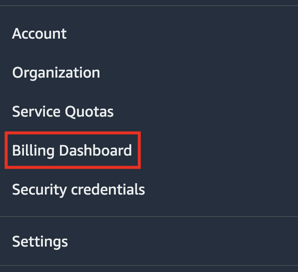
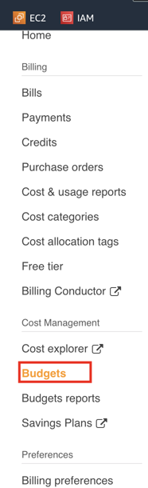
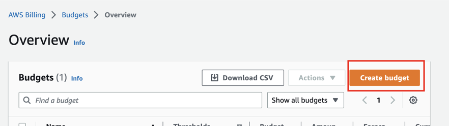
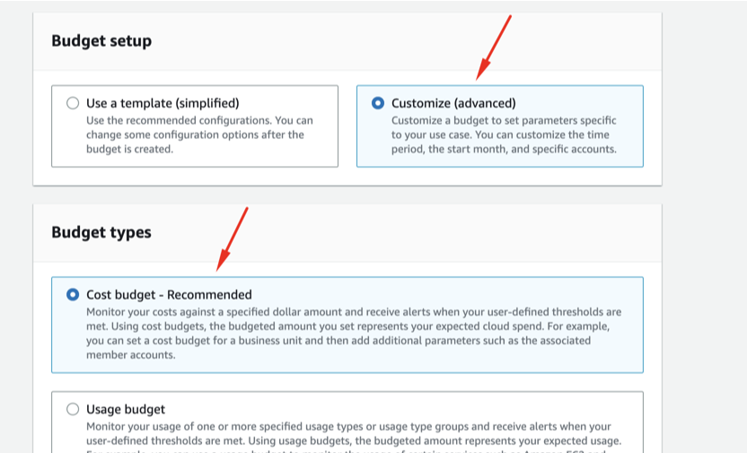
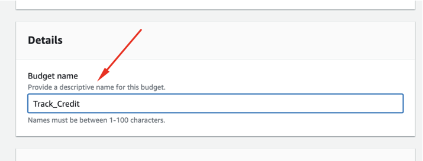
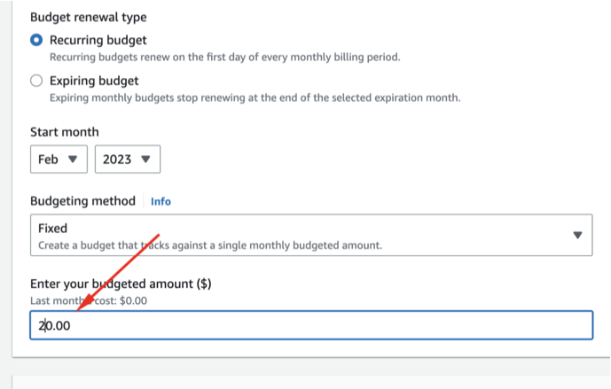
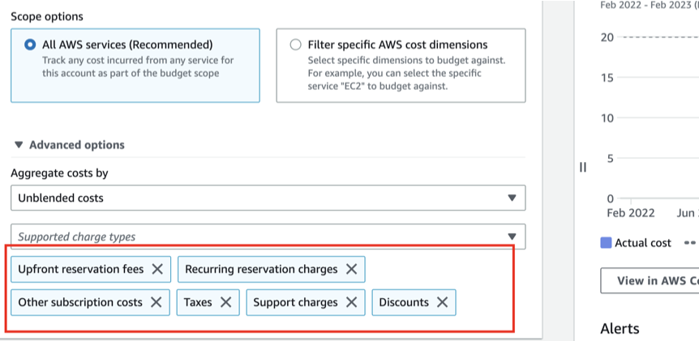
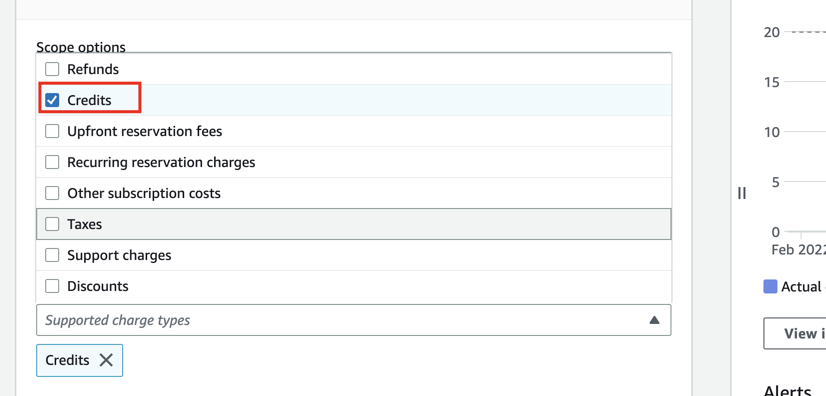
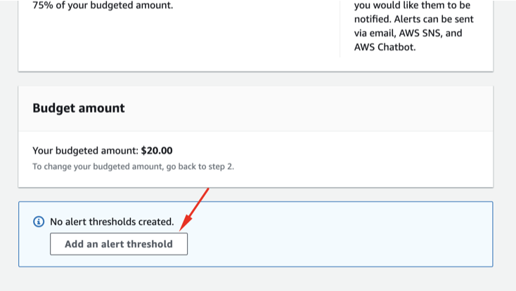
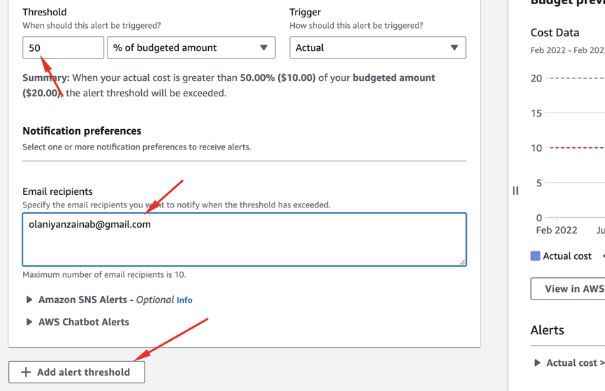

# Week 0 — Billing and Architecture

## Create an IAM user

AWS Identity and Access Management (IAM) is a web service that helps you securely control access to AWS resources. With IAM, you can centrally manage permissions that control which AWS resources users can access. You use IAM to control who is authenticated (signed in) and authorized (has permissions) to use resources.

* Sign in to the AWS Management Console with your root account credentials. Navigate to the IAM service console.
* Choose "Users" in the left-hand menu, then click the "Add user" button.
* Enter a name for the user in the "User name" field.
* Select the "Programmatic access" and/or "AWS Management Console access" to grant the user access to AWS resources via the AWS CLI, SDKs, or the AWS Management Console.
* Choose "Next: Permissions".
* In the "Set permissions" step, grant budget and cost alert permissions.
* Click on the "Permissions" tab and click the "Attach policies" button.
* Select "AWSBudgetsFullAccess" policy.
* Click on "Attach policy". The "AWSBudgetsFullAccess" policy grants the user full access to create, edit and delete budgets and also to receive budget notifications.
* Click "Next: Tags" to add tags to the user (optional).
* Choose "Next: Review" to review your settings, then create user.

## To activate IAM user and role access to the Billing and Cost Management console

* Sign in the AWS Management Console with your root user credentials (using your email address and password).

* On the navigation bar, choose your account name, and then choose Account.

* Next to IAM User and Role Access to Billing Information, choose Edit.

* Select the Activate IAM Access check box to activate access to the Billing and Cost Management console pages.

* Choose Update.

[AWS Official Documentation](https://docs.aws.amazon.com/IAM/latest/UserGuide/tutorial_billing.html?icmpid=docs_iam_console#tutorial-billing-step1)

## MFA

Multifactor authentication (MFA) is a security technology that requires multiple methods of authentication from independent categories of credentials to verify a user's identity for a login or other transaction. 

* Protect and lock your root credentials in a secure place. Make sure you activate Multi Factor Authentication (MFA) too for your root account. And you won’t use this user unless strictly necessary.

* For your newly created admin account, activating MFA for it is a must. It’s actually a requirement for every user in your account if you want to have a security first mindset.

* Now we set up MFA for the [user](https://docs.aws.amazon.com/IAM/latest/UserGuide/id_credentials_mfa_enable_virtual.html)

* login into your IAM user after inputing the MFA code

## Seting up AWS Budgets & Billing Alarms

AWS Budgets is a service that enables you to set custom cost and usage budgets that notify you when you exceed or are forecasted to exceed your budgeted amount. With AWS Budgets, you can track your service usage and your expenses, so you can optimize your costs and adjust your usage when necessary. You can create budgets for specific services or resource groups, set custom alerts, and receive notifications via email or SMS.

Two budgets will be created, one for AWS credits and the other for actual dollar spend

* On the AWS Console, click on your account name and go to billing

* Click on "Budgets" and create a budget

* For AWS Credits,
  * Select "Customized (advanced)", then "Cost budget (recommended)"
  

  * Give the budget a unique name
  

  * Input your budgeted amount
  

  * Under "Supported charges types", choose "credits" only
  
  

  * Next and configure threshold for 50%, 75% and 100% and email address
  
  
  

* For actual dollar spend, 
  * Follow the same steps above except in the "Supported charges types", choose all except "credits"
  

## EventBridge

EventBridge is a serverless service that uses events to connect application components together, making it easier for you to build scalable event-driven applications. Use it to route events from sources such as home-grown applications, AWS services, and third- party software to consumer applications across your organization. EventBridge provides a simple and consistent way to ingest, filter, transform, and deliver events so you can build new applications quickly.

## Conceptual Diagram in Lucid Charts or on a Napkin

A conceptual architecture diagram is a high-level representation of the system that shows the major components and how they interact with each other. It is often used in the early stages of a project to communicate the overall design and approach. This diagram is focused on the business concepts, requirements and goals of the system, and does not get into the details of specific technologies, platforms, or protocols.

[Link](https://lucid.app/lucidchart/ba03d85a-41c1-45f1-9e3b-da36b4acb287/edit?viewport_loc=124%2C-146%2C1461%2C756%2C0_0&invitationId=inv_922c0a19-dccc-46e0-aad6-fb33b7a35c71)

## Logical Architectual Diagram in Lucid Charts

A logical architecture diagram is a more detailed representation of the system that shows how the major components and subsystems fit together, as well as how data flows between them. This diagram is focused on the logical components of the system, and often includes information about specific technologies, platforms, and protocols that will be used.

[Link to View](https://lucid.app/lucidchart/87a4979b-dceb-4aea-bac0-7033fd268960/edit?viewport_loc=7435%2C2500%2C2241%2C1160%2C0_0&invitationId=inv_13d834a0-42dd-465b-8271-43c36de41104)